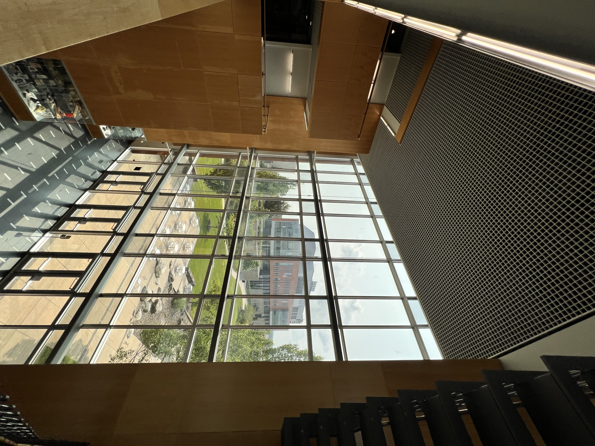
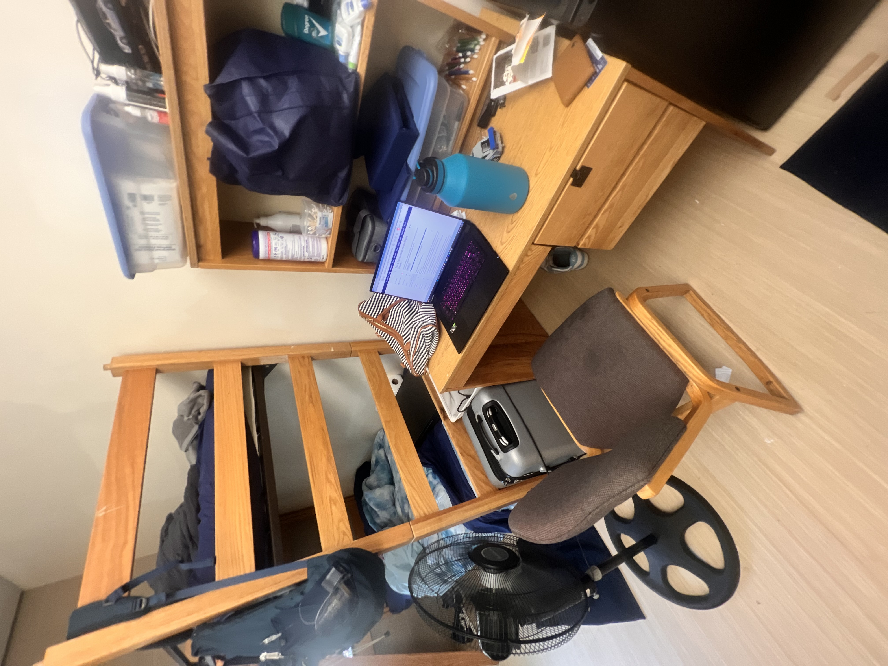
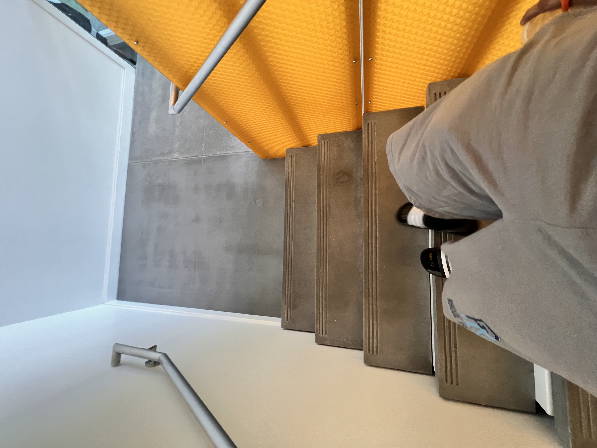
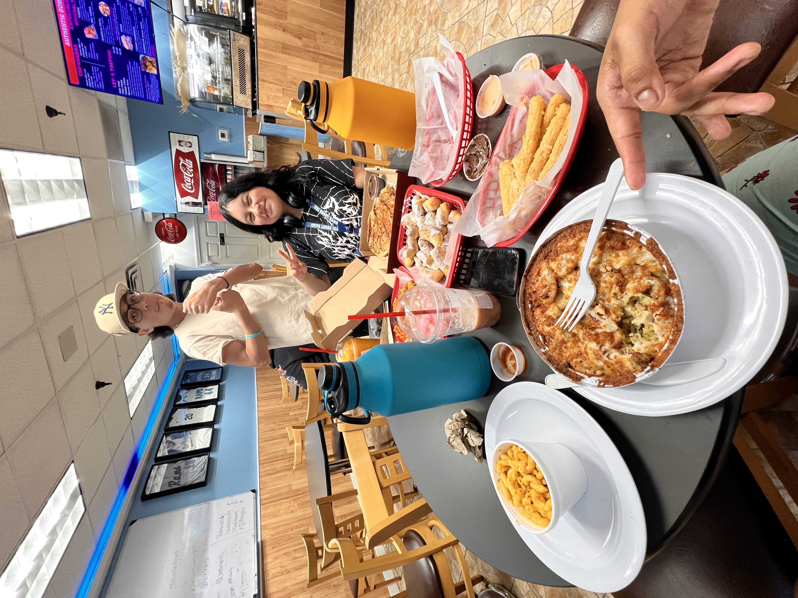

<div id="slideshow">

```{include} _static/play_pause.html
```


````{card-carousel} 2

```{card} 
:class-card: slide
 
```


```{card} 
:class-card: slide

```


```{card} 
:class-card: slide

```

```{card} 
:class-card: slide

```

```{card} 
:class-card: slide

```

```{card} 
:class-card: slide

```

```{card} 
:class-card: slide

```

```{card} 
:class-card: slide

```

```{card} 
:class-card: slide

```

```{card} 
:class-card: slide

```


````
</div>